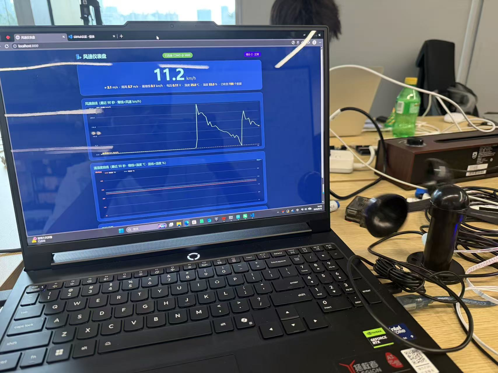
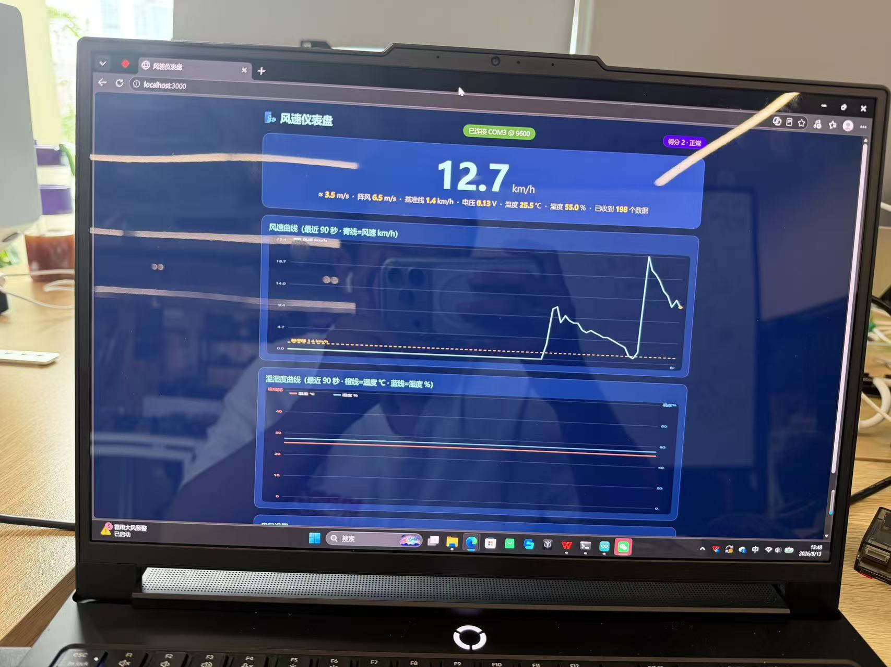
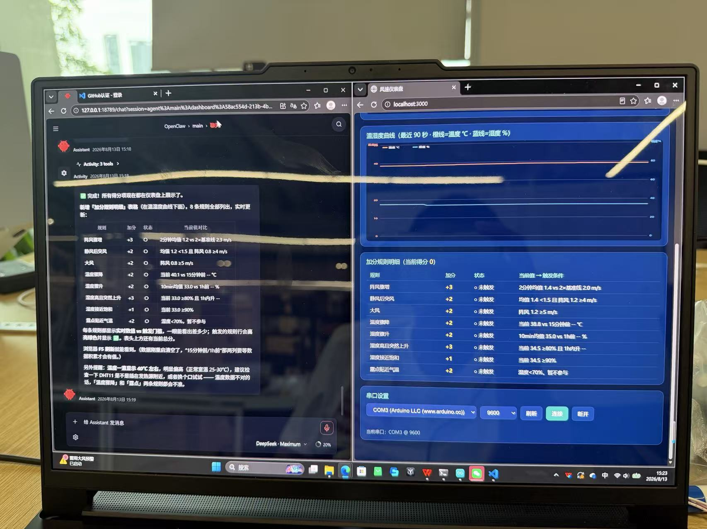

# 风速 + 温湿度监测与预警系统（readme1）

## 这个项目做了什么

本项目由 **Arduino UNO + 三杯式风速传感器 + DHT11 温湿度传感器** 组成，实现：

1. **实时监测**：同时采集风速（km/h）、温度（℃）、湿度（%）
2. **风速报警**：风速超过 10 km/h 时板载 LED 闪烁报警（Arduino 端）
3. **电脑端可视化**：网页仪表盘实时显示风速曲线、温湿度曲线、阵风值、30 分钟平均基准线
4. **智能预警**：根据 8 条气象加分规则计算当前得分，达到阈值自动分级预警（一级/二级/三级），页面横幅警示 + 提示音
5. **数据转发接口**：8001 端口提供 JSON 接口（`/wind`），其他电脑的综合监控系统可以直接调用

## 目录结构

```
风速+温湿度/
├── 02_WindTempHumidity.ino   ← Arduino 主程序（烧录到开发板）
├── readme1.md                ← 本说明文档
└── server/                   ← 电脑端服务器（Python + Node.js 双服务）
    ├── wind_server.py        ← 8001 转发服务（Python）：独占串口，解析数据并转发 JSON
    ├── server.js             ← 仪表盘服务器：轮询 8001 拿数据 + 加分预警引擎 + 网页推送
    ├── read_serial.js        ← 串口调试工具（读 N 秒原始数据）
    ├── package.json / package-lock.json
    ├── 启动仪表盘.bat         ← 双击启动（自动先起 8001 转发，再起仪表盘）
    └── public/index.html     ← 仪表盘网页（前端）
```

## 架构说明（两个服务分工）

```
Arduino (COM3 串口, 9600)
   │
   ▼
wind_server.py  ── 独占串口，解析 CSV/文本，缓存最新值
   │               HTTP :8001/wind  →  {"wind_kmh":..,"wind_ms":..,"temp":..,"hum":..,"time":..}
   ▼
server.js  ── 每 1 秒轮询 8001 转发接口（不再直接占串口）
   │        加分预警引擎 + SSE 推送
   ▼
浏览器 http://localhost:3000（仪表盘网页）
```

> 为什么要这样分：Windows 串口是独占的，多个程序不能同时读 COM3。
> 8001 转发服务（wind_server.py）独占串口，仪表盘（server.js）和其他电脑都通过 HTTP 接口取数据，互不冲突。

## 硬件接线

| 风速传感器 | Arduino UNO |
| ---------- | ----------- |
| 红线 | A0 |
| 黑线 | GND |

| DHT11（背面标 s/v/g） | Arduino UNO |
| --------------------- | ----------- |
| v（VCC） | 5V |
| s（DATA） | D4（没有 D4 可换任意空闲数字脚，改代码 DHTPIN） |
| g（GND） | GND |

## 使用步骤

### 1. 烧录 Arduino 程序
- Arduino IDE 打开 `02_WindTempHumidity.ino`
- 安装库：工具 → 管理库 → 搜索 "DHT sensor library"（Adafruit）
- 选择 Arduino Uno 和对应 COM 口，点上传

> ⚠️ **上传代码前必须先关闭 8001 转发服务**（wind_server.py 独占串口，占着会导致上传报 "cannot open port 拒绝访问"）。仪表盘 server.js 不占串口，不用关。

### 2. 启动服务器（两种方式任选）

**方式 A：双击 `启动仪表盘.bat`**（会自动先启动 8001 转发，再启动仪表盘）

**方式 B：命令行手动启动**
```bash
cd server
python wind_server.py    # 第一个窗口：8001 转发服务
node server.js           # 第二个窗口：仪表盘（或 npm install 后 npm start）
```

浏览器打开 http://localhost:3000

### 3. 其他电脑调用数据接口

局域网内其他电脑（如综合监控系统）直接访问：

```
http://<本机IP>:8001/wind
```

返回 JSON：
```json
{"wind_ms": 2.86, "wind_kmh": 10.3, "time": "16:17:00", "temp": 35.3, "hum": 37.0}
```

- `wind_kmh`：风速 km/h，`wind_ms`：风速 m/s
- `temp`：温度 ℃，`hum`：湿度 %（串口输出 CSV 时才有；文本格式时为 null）
- 串口断线会自动重连（每 5 秒重试）

## Arduino 程序功能（02_WindTempHumidity.ino）

- 风速：ADC → 电压（V）→ 风速（km/h），每 0.2 秒更新
- 温湿度：DHT11 每秒读取一次（太快会读失败）
- 报警：风速 > 10 km/h → 引脚 13 LED 闪烁（不阻塞主循环）
- 串口输出 CSV：`电压,风速,温度,湿度`（波特率 9600）

## 加分预警规则（server.js 实现）

**基准线** = 最近 30 分钟平均风速（黄色虚线画在风速曲线上）
**阵风** = 最近 3 秒内最大风速

| 条件 | 加分 |
| ---- | ---- |
| 阵风骤增：2分钟平均 ≥ 基线的2倍 且 阵风 ≥ 5 m/s | +3 |
| 静风后突风：平均风速 < 1.5 m/s 且 阵风 ≥ 4 m/s | +2 |
| 大风：阵风 ≥ 5 m/s | +2 |
| 温度骤降：现在比 15 分钟前低 5℃ | +2 |
| 湿度骤升：10分钟均值比一小时前提升 ≥ 15% | +2 |
| 湿度高且突然上升：湿度 ≥ 80% 且 一小时内提升 ≥ 15% | +3 |
| 湿度接近饱和：湿度 ≥ 90% | +1 |
| 露点贴近气温：气温 − 露点 ≤ 2℃ 且 湿度 ≥ 70% | +2 |

**预警级别**：得分 ≥ 4 一级，≥ 6 二级，≥ 8 三级

> 得分 = 当前满足条件的分值合计（每项最多算一次）。涉及"15分钟前/一小时前"的规则需要数据积累到对应时长后才会激活。

## 仪表盘功能

- 大字显示：风速 / m/s / 阵风 / 基准线 / 电压 / 温度 / 湿度 / 收到数据数
- 风速曲线（青线 + 黄色虚线基准线）
- 温湿度曲线（橙线温度、蓝线湿度，双轴刻度）
- 得分徽章 + 预警横幅（一级黄 / 二级橙 / 三级红闪烁），升级时响提示音
- 加分规则明细表：8 条规则实时状态（✅触发/○未触发、当前值 vs 门槛），附总分
- 数据来源：轮询 8001 转发接口（每 1 秒一次），转发服务掉线会自动重连

## 项目参考图片







